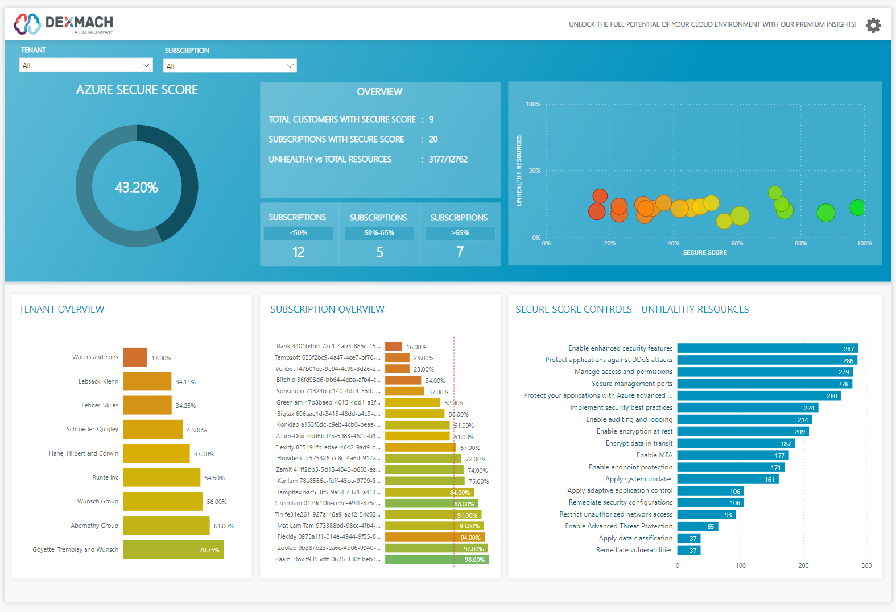
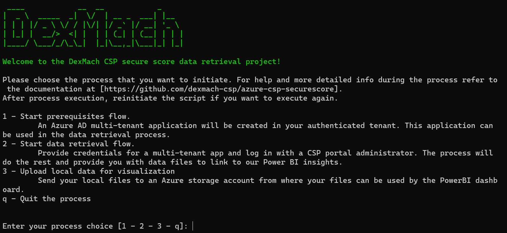

<h1 align="center">AZURE CSP SECURE SCORE</h1>

  Making your landscape visual is an essential first step towards a more robust security posture. For CSPs, this means gaining a clear view of the security posture of all your linked customers.

Run our solution in 5 steps:

  
  

  
  
  
 

<!---

-->

## :memo: Description:

To help CSP's gain visibility on the security landscape of their customers. We've created a tool that makes it easy to gather and visualize your data by leveraging  Azure Secure Score. The tool will guide you through the required setup, gather the data and store it in an Azure Storage Account.
The data in the storage account can than be used by our Power BI template app to visualize your data.

## :book: Getting Started:
-  [1. Account Permissions](docs/account_permissions.md)
-  [2. App Registration Process](docs/app_registration.md)
-  [3. SecureScore Data Process](docs/securescore_data_process.md)
-  [4. SecureScore Data Upload](docs/securescore_data_upload.md)
-  [5. Visualize with Power BI Template App](docs/powerbi_guide.md)

## ⚠️ Get in touch:
If you have any questions regarding this project you can get in touch using <a href="https://github.com/dexmach-csp/azure-csp-securescore/issues">issues</a>, <a href="https://github.com/dexmach-csp/azure-csp-securescore/discussions">discussions</a> or through our <a href="https://www.dexmach.com/security-webinar/">contact form</a>.  
Note: This project was tested on an environment of approx. 500 customers. If you experience any performance issue's please get in touch to discuss your use-case.
