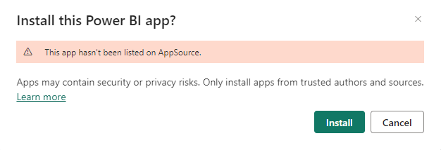
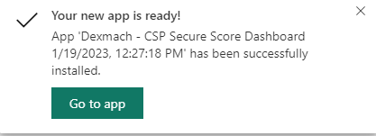
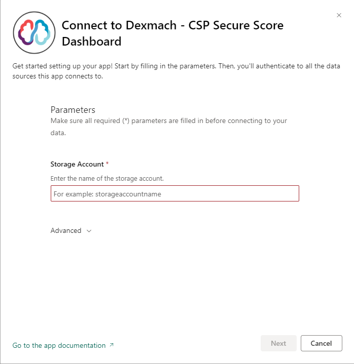
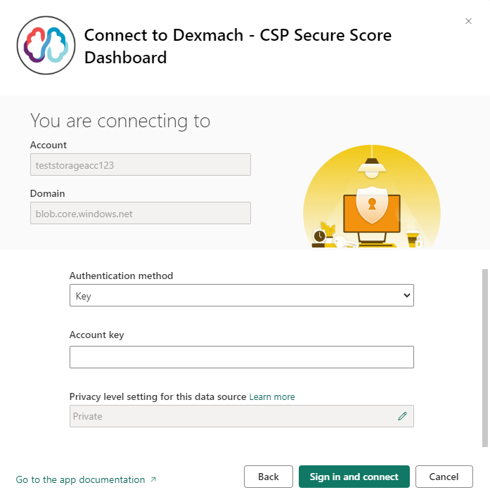

## Power BI Template App
### Prerequisites
 * A PowerBI Environment
 * *Optional* : Power BI Admin : If following setting is not enabled in your Power BI  tenant: Install template apps not listed in AppSource ([More details](PowerBI_settings.md))
 * A user with a Power BI Pro or Premium license.
 * Storage Account with files loaded in correct structure

```
storage_account
└───azure-csp-securescore
└──────2023-01-25T12-34-56
│   │   │   Customers.json
│   │   │   Customerdetails.json
│   │   │   CustomerSubscriptions.json
│   │   │   SecureScores.json
│   │   │   SecureScoreControls.json
│   │   │   AzureSubscriptions.json

```

 * Access key to the storage account

### Installation

1. Install the PowerBI app from Appsource: [Link](https://app.powerbi.com/Redirect?action=InstallApp&appId=5f2129a5-9c6a-4553-8f6a-e57641e13801&packageKey=da576afe-3b28-47e1-8f21-95a4b09d9621Rgkg1zwqoCQjuUPI-e7buNcGEGNPOrtEUozR9Nc5xKk&ownerId=99c75c69-9ef2-4c4e-b5e3-54b6cf95c977&buildVersion=5)

2. Since the app is in pre-production and not listed on AppSource yet, you will receive a popup asking you if it's ok to install the app.  


3. Installing the app may take a few minutes, once the installation has been completed you'll be greeted with a popup notifying you the installation was completed succesfully:  


4. You can now open the app. On the top of the page you'll see a notification saying you are running the app with sample data:
   

   To connect the app to you data in the storage account, press the "Connect your data". 
   
5. Now enter the name of the storage account where you copied the output files to.  


6. Enter the credentials for your storage account and press sign in and connect:  

